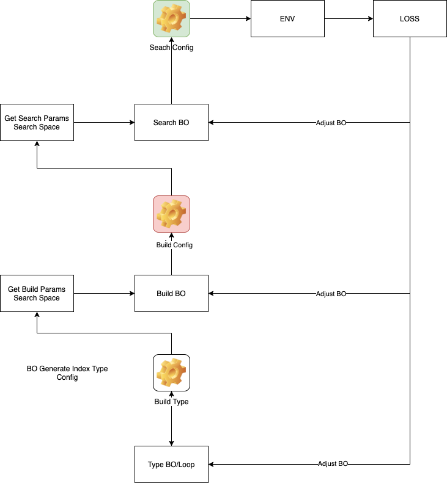

<!--
 * @Author: Xiang Pan
 * @Date: 2021-08-13 18:00:59
 * @LastEditTime: 2021-08-14 22:14:32
 * @LastEditors: Xiang Pan
 * @Description: 
 * @FilePath: /HOBO/REPORT.md
 * xiangpan@nyu.edu
-->

# Introduction
For solving the optimization of milvus hyperparameters, we use the Bayesian Optimization and Hyperband(BOHB)[1](#refer-anchor-1) as our parameter search method.

# Implementation
There are several level hyperparameters in milvus, including index_type, index_params and search_params.
To get an end-to-end solution for index, we use BOHB in different level. For Index Type, to eminent the randomness of BO for index_type(which means BO may not fully explore some specific type due to init poor performance), we set two index type optimization mode(Loop and BO).
## Loss Function
We use laplace method to conver the constraint BO to unconstraint version.
Our loss function is as below:  

$$ Loss = sign(recall, threshold) - query\_per\_sec $$

$$Sign(recall, threshold) = 
\begin{cases}  
recall - threshold & recall>threshold \\
100000 * (threshold - x) & recall<=threshold,
\end{cases}$$

100000 is just a large number for Lagrange method, **threshold is set to 95**.

## Method 

# Hardwareware Information
CPU: Intel Core i7-8700 CPU @ 4.6GHz  
RAM: 2182MiB / 32083MiB

# Index Type Optimization

## 

| Method                | index_type | M  | efConstruction | ef  | recall | query_per_sec | loss     |
|-----------------------|------------|----|----------------|-----|--------|---------------|----------|
| [BOHB(Index Type Loop)](https://wandb.ai/xiang-pan/HOBO/runs/14pnimgi) | 'HNSW'     | 4  | 389            | 167 | 96.13  | 18132.8       | -18131.7 |
| [BOHB(Index Type BO)](https://wandb.ai/xiang-pan/HOBO/runs/1716bulq)   | 'HNSW'     | 17 | 101            | 176 | 99.91  | 17334.7       | -17329.8 |

|                                                              | index_type | nlist | M   | nprobe | recall | query_per_sec | loss          |
|--------------------------------------------------------------|------------|-------|-----|--------|--------|---------------|---------------|
| [Grid Search](https://wandb.ai/xiang-pan/HOBO/runs/3vdvm6gs) | 'HNSW'     | 4     | 158 | 200    | 97.11  | 18331.748252  | -18329.638252 |

# Index Parameters Optimization

## IVF_FLAT

|             | index_type | nlist | nprobe | recall | query_per_sec      | loss                |
|-------------|------------|-------|--------|--------|--------------------|---------------------|
| [BOHB](https://wandb.ai/xiang-pan/HOBO/runs/9ughlu3l)        |    2883 |       54 |    99.68 |           14911 | -14906.3 |
| [Grid Search](https://wandb.ai/xiang-pan/HOBO/runs/22n2lk07) | 'IVF_FLAT' | 14601 | 101    | 100.0  | 14402.032758       | -14397.032758       |

## IVF_SQ8
|                                                              | index_type | nlist | nprobe | recall | query_per_sec | loss         |
|--------------------------------------------------------------|------------|-------|--------|--------|---------------|--------------|
| [BOHB](https://wandb.ai/xiang-pan/HOBO/runs/2hnt39qn)        | 'IVF_SQ8'  | 8405  | 46     | 98.86  | 13827.5       | -13823.7     |
| [Grid Search](https://wandb.ai/xiang-pan/HOBO/runs/26z6cea5) | 'IVF_SQ8'  | 5401  | 101    | 99.49  | 13080.62997   | -13076.13997 |

## IVF_PQ
|                                                              | index_type | m | nlist | nprobe | recall | query_per_sec | loss           |
|--------------------------------------------------------------|------------|---|-------|--------|--------|---------------|----------------|
| [BOHB](https://wandb.ai/xiang-pan/HOBO/runs/2hh95hjr)        | 'IVF_PQ'   | 8 | 3800  | 205    | 70.69  | 10549.1       | 2.42045e+06    |
| [Grid Search](https://wandb.ai/xiang-pan/HOBO/runs/2i7nos9y) | 'IVF_PQ'   | 8 | 8001  | 800    | 70.69  | 1733.677784   | 2432733.677784 |

## HNSW
| Method                                                       | index_type | M  | efConstruction | ef  | recall | query_per_sec | loss          |
|--------------------------------------------------------------|------------|----|----------------|-----|--------|---------------|---------------|
| [BOHB](https://wandb.ai/xiang-pan/HOBO/runs/1gkilnbh)        | 'HNSW'     | 18 | 92             | 157 | 99.85  | 17868.6       | -17863.8      |
| [Grid Search](https://wandb.ai/xiang-pan/HOBO/runs/3vdvm6gs) | 'HNSW'     | 4  | 158            | 200 | 97.11  | 18331.748252  | -18329.638252 |

# TODO:
- Add time Measure to current BO method and progress bar.
- Try to solve the cold-start problem using the feature and best index choice prior.
- We have noticed that m range for IVF_PQ is not suitable, we will increase m and get a result later.

# References

- [BOHB](https://arxiv.org/pdf/1807.01774.pdf)